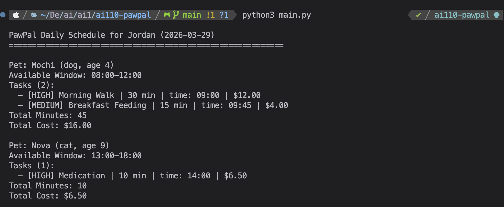
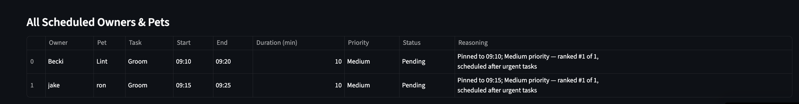
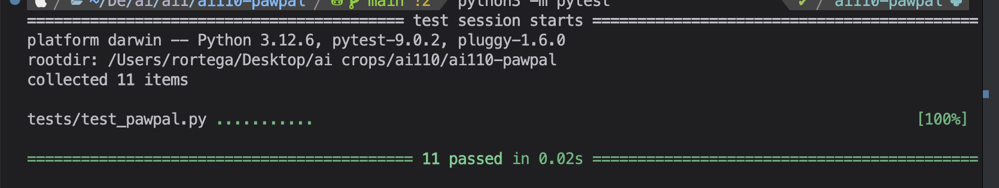
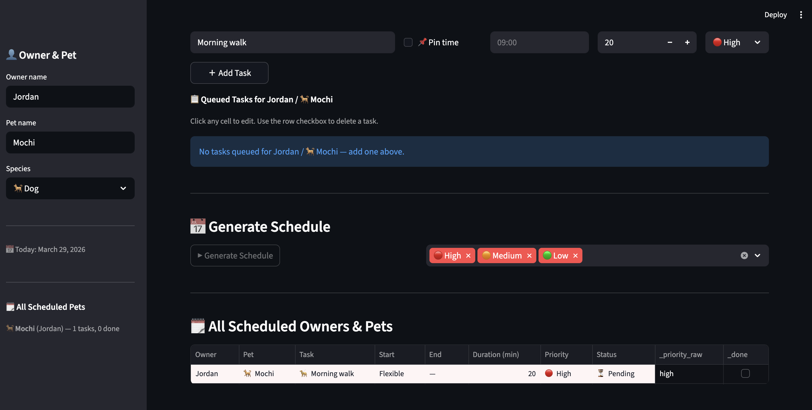

# PawPal+ (Module 2 Project)

You are building **PawPal+**, a Streamlit app that helps a pet owner plan care tasks for their pet.

## Scenario

A busy pet owner needs help staying consistent with pet care. They want an assistant that can:

- Track pet care tasks (walks, feeding, meds, enrichment, grooming, etc.)
- Consider constraints (time available, priority, owner preferences)
- Produce a daily plan and explain why it chose that plan

Your job is to design the system first (UML), then implement the logic in Python, then connect it to the Streamlit UI.

## What you will build

Your final app should:

- Let a user enter basic owner + pet info
- Let a user add/edit tasks (duration + priority at minimum)
- Generate a daily schedule/plan based on constraints and priorities
- Display the plan clearly (and ideally explain the reasoning)
- Include tests for the most important scheduling behaviors

## Core Features & Algorithms

### Task Organization & Sorting
- **Priority-based Sorting**: Ranks tasks as high → medium → low with stable sort to preserve insertion order within same priority
- **Time-based Sorting**: Orders tasks chronologically by time constraint (HH:MM format), placing unconstrained tasks at the end  

### Schedule Validation & Conflict Detection
- **Input Validation**: Rejects tasks with zero/negative duration or negative cost; validates time format (HH:MM)
- **Time Conflict Detection**: Identifies when multiple tasks are scheduled at the same time across different pets in the same time slot
- **Pickup/Dropoff Validation**: Ensures pickup time occurs before dropoff time; flags invalid time sequences

### Pet Health & Status Tracking
- **Senior Pet Detection**: Identifies pets age 7+ for specialized care recommendations
- **Medication Tracking**: Records and identifies pets requiring ongoing medication management
- **Pet Filtering**: Filters tasks by specific pet to view pet-specific schedules

### Recurring Task Management
- **Recurrence Generation**: Automatically generates next occurrence when recurring task (daily/weekly) is marked complete
- **Interval Calculation**: Computes next occurrence date based on recurrence type (daily = 1 day, weekly = 7 days)
- **One-time Prevention**: Marks recurrence as generated to prevent duplicate occurrences

### Aggregation & Reporting
- **Cost Tracking**: Maintains running total of all task costs in a schedule
- **Time Tracking**: Calculates and tracks total minutes allocated across all tasks
- **Filtered Task Views**: Filters across all pet schedules by completion status and pet name
- **Total Calculation**: Dynamically computes schedule totals on demand and refreshes after each modification

## Getting started

### Setup

```bash
python -m venv .venv
source .venv/bin/activate  # Windows: .venv\Scripts\activate
pip install -r requirements.txt
```

### Suggested workflow

1. Read the scenario carefully and identify requirements and edge cases.
2. Draft a UML diagram (classes, attributes, methods, relationships).
3. Convert UML into Python class stubs (no logic yet).
4. Implement scheduling logic in small increments.
5. Add tests to verify key behaviors.
6. Connect your logic to the Streamlit UI in `app.py`.
7. Refine UML so it matches what you actually built.

---

## Bonus Challenges

### Challenge 2: Data Persistence with Agent Mode
- Integrated Claude AI agent mode to allow conversational task management
- Tasks and schedules are persisted to `data.json` so state is preserved between sessions
- Agent can add, remove, and update tasks through natural language commands

### Challenge 3: Advanced Priority Scheduling and UI
- Implemented multi-level priority scheduling (high → medium → low) with stable sort
- Added time-based scheduling with conflict detection across multiple pets
- Built filtering by pet name and completion status for targeted schedule views
- Recurring task generation automatically creates the next occurrence on completion

### Challenge 4: Professional UI and Output Formatting
- Polished Streamlit UI with clear sections for owner info, task input, and schedule display
- Schedule output uses formatted tables with cost and time totals
- Conflict warnings and validation errors are surfaced inline with descriptive messages
- Dedicated formatting module (`formatting.py`) separates display logic from business logic

---

## Screenshots

### App Overview


### Schedule View


### Test Suite


### UI Updates

