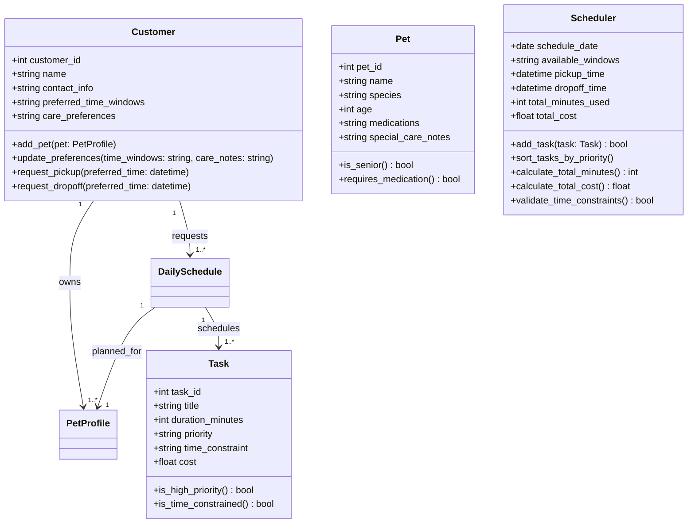

# PawPal+ Project Reflection

## 1. System Design

**a. Initial design**

- Briefly describe your initial UML design.
    **Response:** The diagram consists of four classes. The schedule tracks date and time windows for care appointments, including pickup and dropoff times. The customer info class stores owner details and preferences and connects to pet info, which stores the pet profile and care notes. The task class models each care activity with duration, priority, and cost so it can be scheduled effectively.

- What classes did you include, and what responsibilities did you assign to each?
    **Response:** Classes 
        - Class: Customer Info
            + int customer_id
            + str name
            + str contact_info 
            + str preference
            + add_pet()
            + update_preference()
            + request_pickup() 
            + request_dropoff()
        - Pet Info 
            + int pet_id 
            + str name
            + str type (dog, cat)
            + int age
            + string medications
        - Tasks
            + int task_id
            + string title
            + int duration_minutes 
            + is_priority()
            + float cost
        - Schedule
            + date date
            + string windows
            + datetime pickup_time
            + datetime dropoff_time
            + int total_mins
            + float total_cost

### Mermaid Class Diagram (Refined UML)

**b. Design changes**

- Did your design change during implementation?
    **Response:** I started with five classes for the diagram, but then I noticed we can reduce it to four classes to keep it minimal and simple to understand the scope of the app. One thing I did forgot to implement on my draft was the id for each, as it will make it more simple to connect. 

- If yes, describe at least one change and why you made it.
    **Response:** With the agent, it added more details of how the class diagram should be structured. There are more methods and attributes added that does make sense. We went from five to four for a more clearer diagram and added some methods into the customer's class. 

---

## 2. Scheduling Logic and Tradeoffs

**a. Constraints and priorities**

- What constraints does your scheduler consider (for example: time, priority, preferences)?
    **Response:** The task has a boolean to determine if it is a priority or not. We may want to have a priority if the pet has a medical needs to ensure no bad outcome. The scheduler focus more on time to ensure we can meet the availability to complete as many services as needed for the shift. 

- How did you decide which constraints mattered most?
    **Response:** I believe that priority would be the most important if we want to keep customers satisfied with the owner's services and bring returning customers along with building rapport. 

**b. Tradeoffs**

- Describe one tradeoff your scheduler makes.
    **Response:** Currently, the simplicity of the schedule accepts even there is conflicted with the time window, so will need to adjust this to ensure it will not go over the schedule. This is manual ordering, in where it will not adjust to the best time practices. Highly will implement a feature that will automatically adjust the slots.

- Why is that tradeoff reasonable for this scenario?
    **Response:** Clarity on the task that adds totals from the full task list. Since this is a small business, there is no need to implement complexity, unless it is needed scale. 

---

## 3. AI Collaboration

**a. How you used AI**

- How did you use AI tools during this project (for example: design brainstorming, debugging, refactoring)?
    **Response:** Definitely had it assist me with the brainstorming the system designing as I have not been practicing on this. Getting the trade offs of each feature helped me understand what could be needed for an app that does not require too much depth of complexity. There was some trail and error but the limitation of my time for this prevented me to look into the code and review it a few times. 

- What kinds of prompts or questions were most helpful?
    **Response:** Provide the context of my brainstorm and apply any recommended attributes and methods that will need for the application. How can I better understand this part of the code, is there any edge cases that we can over look into? 

**b. Judgment and verification**

- Describe one moment where you did not accept an AI suggestion as-is.
    **Response:** 

- How did you evaluate or verify what the AI suggested?

---

## 4. Testing and Verification

**a. What you tested**

- What behaviors did you test?
    **Response:** The mainly tests that handle sorting correctness, recurrence logic, and conflict detection. There are a total of 11 tests in the test file check other cases with an additional edge case to handle. 

- Why were these tests important?
    **Response:** These will help narrow down possibilities that prevent user error and verify the expected behaviors are working without second guessing the output. 

**b. Confidence**

- How confident are you that your scheduler works correctly?
- What edge cases would you test next if you had more time?

---

## 5. Reflection

**a. What went well**

- What part of this project are you most satisfied with?

**b. What you would improve**

- If you had another iteration, what would you improve or redesign?

**c. Key takeaway**

- What is one important thing you learned about designing systems or working with AI on this project?
    **Response:** Without a bearbone context of how the structure of designing a system diagram will delay the work needed to ensure the scope of the project is needed. AI was able to assist with improving the application but needs some redirection to ensure it will meet the requirements. Seems that I need to study more about system design, it has been a while. 
